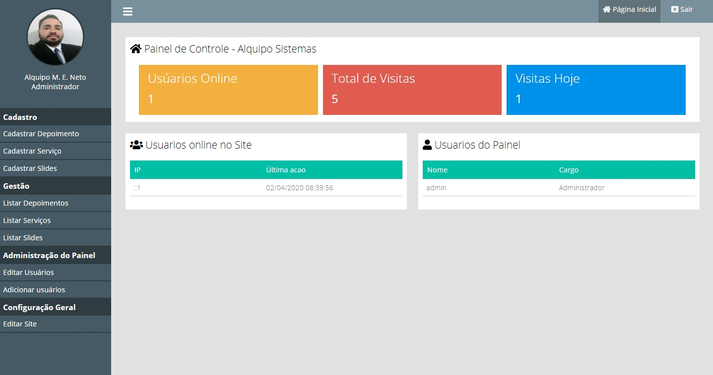
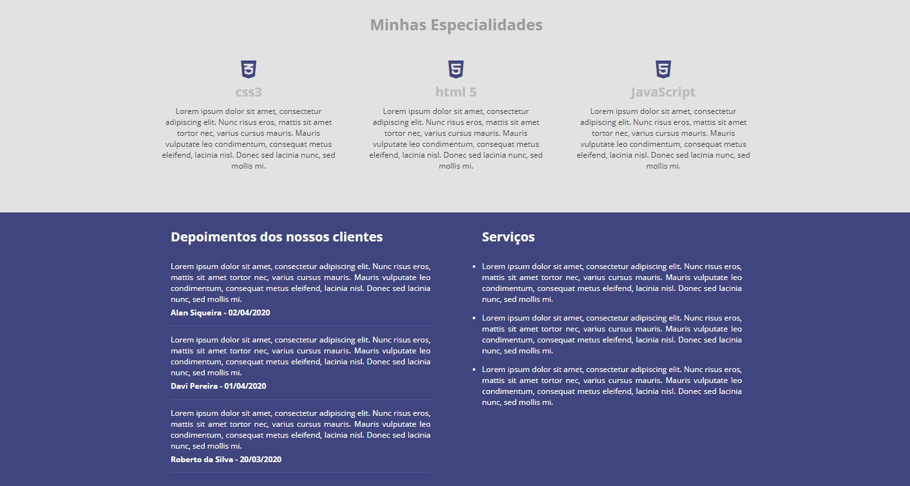
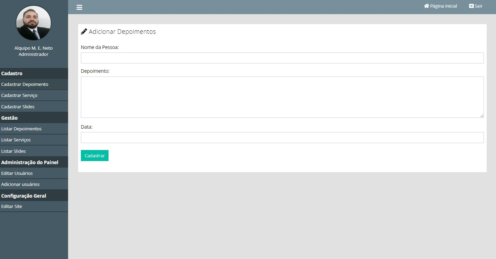
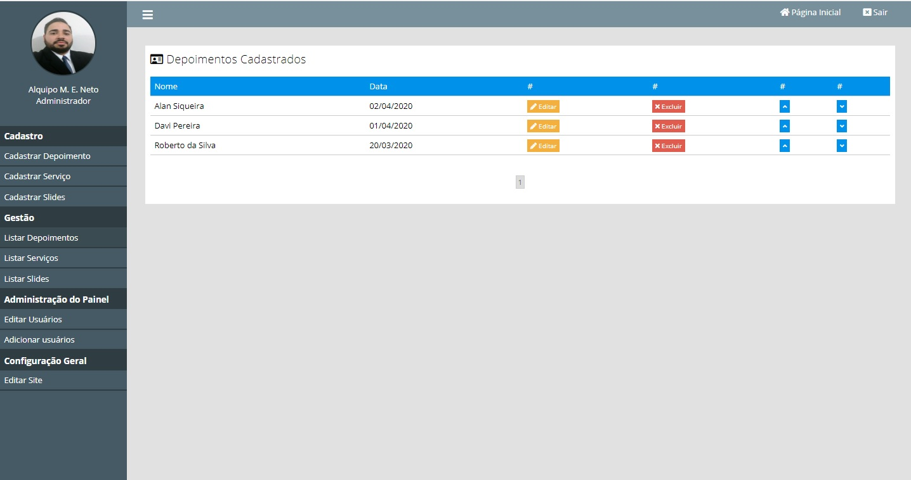

# Site-Painel-PHP
Criando um painel dinâmico para um site, Aprendendo a tecnologia PHP

              ***Site de Exemplo ******                          ***Painel para mudanças dinamicas em PHP ******

  
  
 
